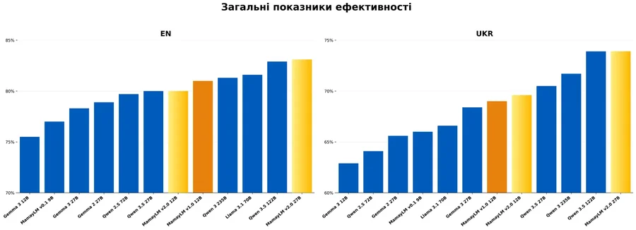
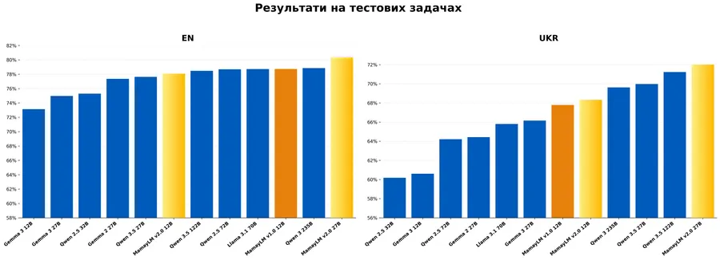
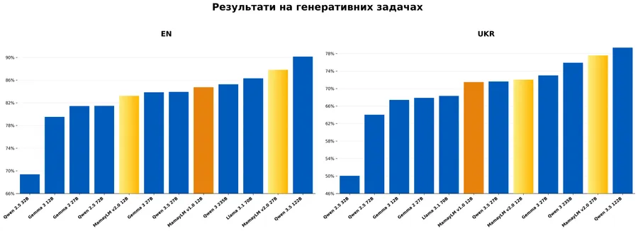
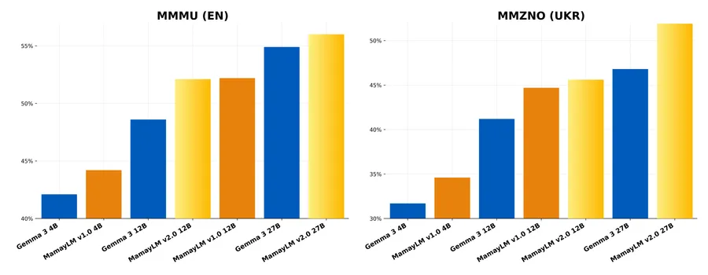

# loc-lm-bench -- Local Language Model Benchmark

Pick the best open-weight LLM for **your** Ukrainian RAG and text-analysis tasks, on **your**
hardware. Public leaderboards measure general capability on someone else's data with unlimited
VRAM; loc-lm-bench re-ranks a handful of candidate models on your own corpus, on a single
desktop GPU (validated on an RTX 4060 Ti 16 GB), so the choice is reproducible and defensible.

Status: runnable end to end -- data prep, Ollama + vLLM serving, telemetry, and a ranked board.
See [what's built today](docs/implementation/current.md) and the
[forward plan](docs/implementation/plan.md).

## Features

| Aspect | What you get |
|---|---|
| Corpus-grounded | Scores models on your documents + a span-labeled Ukrainian gold set, not transferred public scores. |
| Source-span labels | Gold labels are document char offsets (not chunk ids), so they survive `chunk_size` tuning. |
| Backend-agnostic | One OpenAI-compatible interface; Ollama + vLLM ship today (llama.cpp planned), chosen per model by an availability resolver. |
| Hardware-aware | `list-models` reports what fits your GPU + RAM (KV-cache-aware, with a GPU/CPU layer split). |
| Defensible scoring | Objective reference correctness ranks models; an LLM judge enters only after Ukrainian calibration (Spearman rho >= 0.6), else it stays demoted. |
| Rigorous board | Average rank + Pareto front + bootstrap confidence intervals; process-isolated, VRAM/thermal-gated sweeps. |
| Reproducible | Canonical run manifests, deterministic disjoint splits, a local MLflow mirror, no heavy services. |

## Quick start

Requires [`uv`](https://docs.astral.sh/uv/) (it fetches Python 3.11 for you) and a running
Ollama (`ollama serve`). One **idempotent** command runs the whole pipeline end to end:

    make demo-eval     # venv -> gold set -> index -> prep-models -> eval + telemetry
    make mlflow        # review runs at http://127.0.0.1:5000

That builds `.venv` (all extras), indexes the committed 250-item public fixture, pulls a smoke
model, and records one ranked row + telemetry under `.data/llb/`. Run `make` with no target to
list every command.

### First run: configure `.env`

The first `make demo-eval` (or `make venv`) copies `.env` from `.env.example`, then stops with a
setup notice so you can configure this host before anything runs. This is expected -- it exits
cleanly (status `0`) and is **not** an error. Edit the new `.env`, then re-run `make demo-eval`:

- `HF_TOKEN` -- a Hugging Face read token for gated downloads (MamayLM, Gemma 4, ingest/prep).
  Get one at <https://huggingface.co/settings/tokens>.
- Host defaults -- `DATA_DIR` (where indexes / runs / MLflow are written), `OLLAMA_HOST` /
  `VLLM_HOST` (candidate inference endpoints), and `JUDGE_MODEL` / `DEEPEVAL_JUDGE_BASE_URL`
  (optional local judge; off unless `JUDGE_MODEL` is set). `.env.example` documents every
  variable with its default.

Once `.env` exists, re-runs skip the notice and the pipeline proceeds. With `UV_LINK_MODE` unset
(or `auto`), `make` resolves uv's link mode per host: it selects `copy` when this checkout sits on
a different disk than uv's cache (avoiding a cross-filesystem hardlink warning) and keeps uv's fast
default when they share a disk. Set a specific mode (`copy|hardlink|clone|symlink`) to force it.

## Commands by result

The pipeline is a chain: **prepare data -> build retrieval -> run + rank -> scale -> review.**
`make venv` installs everything once; `make test` runs the suite (297 tests).

### 1. Prepare data

| Command | Result |
|---|---|
| `make validate-goldset` | Validates the committed fixture and its exact source spans. |
| `make ingest-uk-squad GOLDSET_MODE=development` | Reproduces the pinned reviewed UA-SQuAD fixture (may need `HF_TOKEN` in `.env`). |
| `make ingest-uk-squad GOLDSET_MODE=skeleton` | A from-scratch authoring template. |
| `make build-rag-store` | Chunks `samples/corpus` (fixed / sentence / recursive / markdown / semantic). |

### 2. Build + validate retrieval

| Command | Result |
|---|---|
| `make list-models` | Which candidates fit this GPU + RAM (context, layer split). |
| `make prep-models` | Detects the GPU; pulls Ollama tags + caches vLLM HF weights. |
| `make build-index` | Chunks + embeds the corpus into a FAISS store. |
| `make validate-retrieval` | recall@k / MRR of the pinned embedding (validates retrieval, not models). |

### 3. Run, rank, review

| Command | Result |
|---|---|
| `make run-eval MODEL=llama3.2:3b` | One ranked row + a reproducible manifest (Ollama). |
| `llb run-eval --config samples/run_config_vllm_uk.yaml --telemetry` | A real vLLM run with tokens/sec + peak VRAM. |
| `make board` | The Streamlit leaderboard: average rank, Pareto front, CIs. |
| `make mlflow` | Local MLflow UI for deep run inspection + compare. |

### 4. Scale: screen, sweep, tune

| Command | Result |
|---|---|
| `llb screen-public` | Tier-1 public screen via lm-evaluation-harness-uk (cheap candidate narrowing). |
| `llb sweep --sweep-id run1` | Process-isolated, resumable N-model sweep (VRAM + thermal gated). |
| `llb tune --model <m> --backend <b>` | Two-stage Optuna RAG tuning (tuning split -> final-split score). |
| `llb pipeline` | finalists -> tune -> final board, chained. |

### Optional: gated LLM judge

| Command | Result |
|---|---|
| `make calibration-run JUDGE_MODEL=... JUDGE_BASE_URL=...` | Pre-fills the calibration worksheet (model answers + judge ratings). |
| `make calibration-score RATINGS=<filled.csv>` | Spearman rho + CI + trust decision (after a human fills `human_rating`). |

Calibration needs human ratings; until rho >= 0.6 the judge stays demoted and objective
correctness ranks alone. See the [judge guide](docs/guides/judge-experiments.md).

## Documentation

Start at the [documentation index](docs/README.md). High-level entry points:

| Doc | What it covers |
|---|---|
| [What's built today](docs/implementation/current.md) | Delivered milestones, modules, and exact command behavior. |
| [Forward plan](docs/implementation/plan.md) | The ordered, dependency-aware roadmap (M4 -> M5 -> M6 + human lane). |
| [Design spec](docs/design/spec.md) | Problem, wedge, architecture, and the recorded decisions. |
| [Learning path](docs/guides/learning-path.md) | Learn the whole stack from basics: a staged syllabus + curated links. |
| [AGENTS.md](AGENTS.md) | Contributor + agent guardrails. |

## Learn the stack

New to RAG, local LLM serving, or LLM-as-judge evaluation? The
[learning path](docs/guides/learning-path.md) is a staged syllabus -- from basic Python + ML to
this project's full stack -- with curated links and a pointer to where each technology lives in
the repo. It includes a time-boxed plan for a learner with basic knowledge.

## Related projects

Ukrainian eval prior art (consumed as a free prior; loc-lm-bench is **not** a public
leaderboard -- it re-ranks on your private corpus):

| Project | Links | Role here |
|---|---|---|
| Ukrainian LLM Leaderboard | [HF](https://huggingface.co/spaces/lang-uk/ukrainian-llm-leaderboard) / [GitHub](https://github.com/lang-uk/ukrainian-llm-leaderboard) | Public UA ranking + results dataset; a transfer baseline. |
| lm-evaluation-harness-uk | [GitHub](https://github.com/insait-institute/lm-evaluation-harness-uk) | INSAIT EleutherAI fork; powers the Tier-1 public screen. |

Best candidate models (Ukrainian-specialized + strong multilingual bases the harness ranks):

| Model | Links | Role here |
|---|---|---|
| MamayLM v2 (12B / 27B) | [site](https://models.mamay.ai/) / [HF](https://huggingface.co/collections/INSAIT-Institute/mamaylm-v20-gemma-3) | Gemma-3-based, UA-specialized; top candidate and a possible local judge. |
| Lapa LLM | [HF](https://huggingface.co/spaces/lapa-llm/lapa) / [GitHub](https://github.com/lapa-llm/lapa-llm) | lang-uk Ukrainian model; UA-specialized candidate. |
| Google Gemma 4 | [HF](https://huggingface.co/collections/google/gemma-4) | Strong multilingual base; `gemma-4-E4B` validated end to end here. |
| Alibaba Qwen 3.6 | [HF](https://huggingface.co/collections/Qwen/qwen36) | Strong multilingual base; a non-Gemma cross-check judge candidate. |

## MamayLM v2 benchmarks (reference)

MamayLM v2 is a top Ukrainian-specialized candidate (see Related projects). The charts below are
from the INSAIT MamayLM v2 release post, included here for reference and context -- they are not
loc-lm-bench results.

*Overall benchmark comparison.*

*Log-probability (MCQ) benchmarks.*

*Generative benchmarks.*

*Multimodal benchmarks.*

Attribution: images (c) INSAIT / MamayLM, from the
[MamayLM v2 release post](https://models.mamay.ai/blog/mamaylm-v2-release-en/) (downscaled for
size). Reproduced for reference and comparison with attribution; all rights remain with the
original authors. See the [MamayLM site](https://models.mamay.ai/) for licensing and terms.
